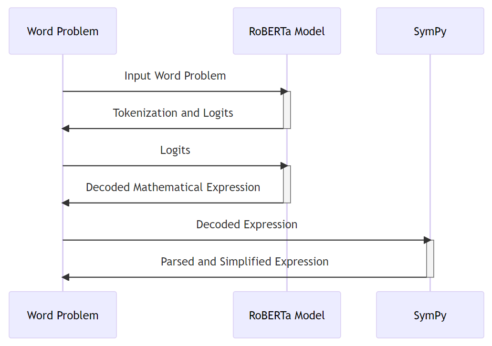

# ExEqGen: An External Symbolic Solver for Mathematical Word Problem Solving



## Requirements

To install requirements:

```setup
pip install -r requirements.txt
```

>  - Python version should be greater than or equal to 3.7.


## Pre-Process
<!-- To preprocess the file to the model desires, run the following command:
```preprocess
cd bash_script
./start_process.sh
```
> - For either FinQA or MathQA dataset, just uncomment the correspoding code block, which prefers the absolute path for the files. -->

 -->
## Training

To train the model(s) in the paper, run this command:

```train
cd bash_script
./start_train.sh
```

> - Data Path: This is similar to the pre-process step, just uncomment the path information of the data set you want (FinQA or MathQA).
> - Training is conducted on an NVIDIA H100 80GB GPU. With a train batch size of ten, FinQA and MathQA training times could be twelve hours and fifty-two hours, respectively. 

## Evaluation

To evaluate my model, run:

```eval
cd bash_script
./start_test.sh
```
> - Data Path: This is similar to the train step; simply uncomment the desired test data set's path information (FinQA or MathQA). 

After obtaining the prediction results, you need to calculate the **Prog Acc** for FinQA, run:

for FinQA, run:

```eval
cd models
python calculate_metrics_finqanet.py
```

for MathQA, run:

```eval
cd models
python calculate_metrics.py
```

## Pre-trained Models

You can download pretrained models here:

- [ELASTIC (RoBERTa-large) for FinQA](https://drive.google.com/file/d/13HKmOp4o_-nKxjF5l-pKPW6n1RZ55WZ-/view?usp=sharing).
- [ELASTIC (RoBERTa-large) for MathQA](https://drive.google.com/file/d/1Q6XEstn678tzHMxiaOKLJpqtQot_2T1s/view?usp=sharing).

## Results

Our model achieves the following performance:

| Model and Datasets      |  FinQA (test)| MathQA (test) |
| ----------------------- |----------|---------  |
|                         | Prog Acc | Prog Acc  |
| FinQANet(RoBERTa-base)  |  58.38   |   74.12   |
| FinQANet(RoBERTa-large) |  63.52   |   79.20   |
| ELASTIC (RoBERTa-base)  |  59.28   |   82.27   |
| ELASTIC (RoBERTa-large) |  65.21   |   83.00   |
| ExEqGen (RoBERTa-base)  |  62.75   |   84.19   |
| ExEqGen (RoBERTa-large) |  68.18   |   85.29   |

>📋  FinQANet and ELASTIC results are directly obtained from the original paper. 